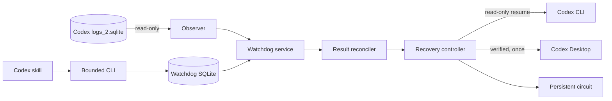

# Codex Resilience Watchdog

[](https://github.com/maidytao/codex-resilience-watchdog/actions/workflows/ci.yml)
[](https://www.python.org/downloads/)
[](LICENSE)

An evidence-based, Windows-first watchdog for long-running Codex tasks. It
detects stalled work, checks the real outcome, and performs tightly bounded
recovery without replaying side effects.

**[简体中文说明](README.zh-CN.md)**

> [!IMPORTANT]
> This project is experimental (`0.1.x`). Review the safety model before using
> automatic recovery on important work.

## Why this project

Long agent tasks can stall during tool calls, remain in Thinking, or leave an
operation with an uncertain result. Retrying blindly is unsafe: the previous
attempt might already have written a file, sent a message, deleted data, or
created a charge.

Codex Resilience Watchdog uses a different rule:

1. Observe Codex logs without modifying them.
2. Reconcile the declared result against durable evidence.
3. Automatically resume only a `read-only` and explicitly `repeatable` step.
4. Stop at `pending-confirmation` for every uncertain side effect.
5. Open a persistent circuit before recovery can loop.

## Safety model

| Boundary | Enforcement |
|---|---|
| Automatic replay | Only `read-only` + `repeatable` checkpoints |
| Side effects | `write`, `external-message`, `delete`, `paid`, and `unknown` never replay automatically |
| Uncertain result | Inspect the declared probe before deciding what to do |
| Recovery ceiling | At most two automatic recoveries per task |
| Restart ceiling | At most one verified Codex Desktop restart per task |
| Repeated fault | The second matching fault fingerprint opens the circuit |
| Progress | Timer ticks and unchanged Thinking text are not progress |
| Codex data | `logs_2.sqlite` is opened with `mode=ro` and `query_only=ON` |

The watchdog does not modify Codex configuration, task history, rollouts, or
project files. It does not install into or operate on OpenClaw.

## Requirements

- Windows 10 or Windows 11
- Codex Desktop and a Codex CLI that supports `codex exec resume`
- Python 3.12 or newer
- Windows PowerShell 5.1 or PowerShell 7

## Quick start

Clone and test the project:

```powershell
git clone https://github.com/maidytao/codex-resilience-watchdog.git
cd codex-resilience-watchdog
python -m pip install -e .
python -m unittest discover -s tests -t . -v
```

Preview installation without changing anything:

```powershell
powershell -NoProfile -ExecutionPolicy Bypass -File .\scripts\install.ps1 -DryRun -Enable
```

Install the Codex skill and start the per-user watchdog:

```powershell
powershell -NoProfile -ExecutionPolicy Bypass -File .\scripts\install.ps1 -Enable
```

No administrator privileges are required. The installer writes only to the
resolved Codex home (normally `%USERPROFILE%\.codex`) and registers one
per-user startup entry.

## Verify the installation

```powershell
$watchdog = "$env:USERPROFILE\.codex\skills\codex-resilience-watchdog\scripts\watchdog.py"
python $watchdog status
python $watchdog incidents --limit 50
```

The skill `$codex-resilience-watchdog` becomes available to Codex after
installation. It records long-task checkpoints through the same wrapper.

## Task protocol

```powershell
python $watchdog arm --task TASK_ID --session SESSION_ID --class ordinary --threshold 300
python $watchdog heartbeat --task TASK_ID --evidence "tool output advanced"
python $watchdog checkpoint --task TASK_ID --step STEP_ID --effect read-only --repeatable --input-digest DIGEST --probe file-exists --target PATH
python $watchdog complete --task TASK_ID
```

Do not put prompts, secrets, credentials, or message bodies in task IDs,
heartbeat evidence, or input digests. See the
[protocol reference](skills/codex-resilience-watchdog/references/protocol.md)
for all effects, probes, and states.

## Operations

```powershell
python $watchdog status
python $watchdog incidents --limit 50
python $watchdog disable
python $watchdog enable
python $watchdog reset-circuit --task TASK_ID --reason "actual outcome and fault cause verified"
```

Reset a circuit only after checking the actual result and fault cause. A reset
does not erase recovery counters or make a side effect replayable.

## Update and uninstall

```powershell
# Update an existing installation and enable it
powershell -NoProfile -ExecutionPolicy Bypass -File .\scripts\install.ps1 -Enable -Force

# Remove the runtime, skill, and startup entry; preserve state and audit data
powershell -NoProfile -ExecutionPolicy Bypass -File .\scripts\uninstall.ps1

# Also remove watchdog-owned state and audit data
powershell -NoProfile -ExecutionPolicy Bypass -File .\scripts\uninstall.ps1 -PurgeData
```

Default uninstall preserves the SQLite state, logs, and backups. `-PurgeData`
is explicit and path-checked before it removes the watchdog-owned data folder.

## Architecture



Read [docs/architecture.md](docs/architecture.md) for state transitions,
storage boundaries, recovery decisions, and failure handling.

## Development

The runtime uses only the Python standard library.

```powershell
python -m unittest discover -s tests -t . -v
python -m compileall -q src scripts skills\codex-resilience-watchdog\scripts
```

See [CONTRIBUTING.md](CONTRIBUTING.md) before submitting a change and
[SECURITY.md](SECURITY.md) for private vulnerability reporting.

## Acknowledgements

This is an independent implementation informed by the persistent supervision
ideas in [openclaw-task-watchdog](https://github.com/maidytao/openclaw-task-watchdog)
and the Codex-oriented recovery ideas in
[codex-task-watchdog](https://github.com/TanChuping/codex-task-watchdog). It does
not vendor either project.

## License

[MIT](LICENSE) © 2026 maidytao
