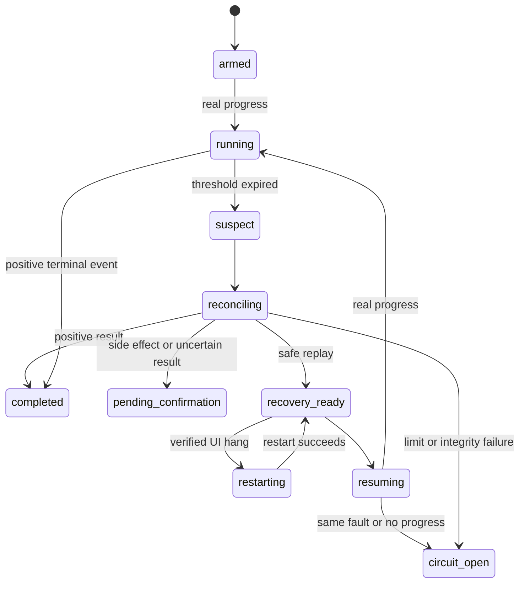

# Architecture

Codex Resilience Watchdog is a Windows-first, Codex-only supervisor. Its design
separates observation, durable state, reconciliation, and recovery so that a
stalled task never turns directly into an unbounded retry.

## Components

### Codex skill and bounded CLI

The installed skill explains when to arm a task, what counts as progress, how
to classify effects, and when automation must stop. Its wrapper resolves the
runtime from `CODEX_HOME`; it does not depend on the current working directory.

The CLI exposes bounded commands for task registration, checkpoints, status,
incidents, recovery, circuit reset, enablement, and daemon operation. It does
not accept arbitrary commands or scripts as probes.

### Read-only observer

`CodexLogObserver` opens Codex `logs_2.sqlite` with SQLite URI `mode=ro` and
enables `PRAGMA query_only=ON`. Reads are filtered by the declared session and
hard-capped at 1,000 rows. The observer never modifies Codex databases,
rollouts, history, or configuration.

### Watchdog-owned state

The watchdog stores its own SQLite database under `CODEX_HOME/watchdog`. It
persists:

- task state and no-progress thresholds;
- real-evidence heartbeats and log cursors;
- effect-classified checkpoints and result probes;
- recovery generations, restart counts, and fault fingerprints;
- atomic recovery leases, incidents, and durable circuits.

Terminal tasks cannot return to a running state. A circuit reset moves a task
to manual confirmation; it does not erase counters.

### Result reconciliation

Before replay, the reconciler checks one declared probe:

- `file-exists` — whether a target exists;
- `file-sha256` — whether a target matches an expected digest;
- `backend-terminal` — whether a positive terminal result is already recorded.

Unknown probes are uncertain. Probes never execute arbitrary commands.

### Recovery controller

The controller acquires an atomic lease, reconciles the last checkpoint, and
evaluates a closed replay policy. Automatic resume is available for exactly
one combination: `read-only` and `repeatable` with evidence that the intended
result is still missing.

The resume command uses fixed arguments:

```text
codex -s read-only -a never exec resume SESSION_ID PROMPT --json
```

No approval-bypass or sandbox-bypass flag is used.

### Process controller

Restart is considered only after the Windows UI reports the unique,
current-user Codex Desktop main window as unresponsive. The exact executable
path is checked again immediately before stopping the process. The restart
manifest and counter are persisted before termination. A second restart is
not allowed.

## State flow



## Loop prevention

The durable circuit opens when any of these conditions is met:

- two automatic recoveries have already been attempted;
- a second restart is requested;
- the same fault fingerprint occurs twice;
- state integrity or CLI compatibility cannot be verified;
- a recovery produces no real progress;
- resume or restart fails.

Daemon restarts do not reset these counters. Timer ticks, repeated Thinking
text, and the watchdog process being alive are never counted as progress.

## Filesystem boundary

The installer and runtime own only:

```text
CODEX_HOME/
  skills/codex-resilience-watchdog/
  watchdog/
    app/
    backups/
    logs/
    recovery-manifests/
    resilience.db
    install-manifest.json
```

Paths are resolved and checked before writes or removals. Default uninstall
preserves state, logs, and backups; purge is explicit and limited to the
watchdog-owned data root.

